# Leadership vs Management

This repo contains the legacy, history and active legal instruments/mechanisms under the various governance mechanism as depicted in the constitution, the {~~D~~/Ð/D}UNA. The distinction is that you **lead** people, but **manage** things (though lexy+✗a¥ will sulk). Policies are waveguilds that shape the information [flow](https://en.wikipedia.org/wiki/Organisational_semiotics) that:
1. connect the **future** (purpose) and **past** (legacy);
2. act as a source of (di/con)vergent forces between **resources** and **capabilities**;
3. provide a **trail** (with occasional **fences/gates**) based on sweat/blood/tears as to [what/how](https://fs.blog/chestertons-fence/) is done.

As an arbitrary dividing line, we note in passing the _BarRogue_ period (there's a reason why its the argument of lawyers) and the _NeoClass_ thereafter with its squabble of legal engineers emerging as a distinctive profession separate from, but complementary to, cyberlaw or DeFi-ance degens. Sometimes it's insignificant what active policies are retained but what is [jetisoned](https://github.com/lexDAO/LexDAO-Constitution) (financial refactoring, technical debt, cultural cruft) that are worthy of note. Those who don't learn from the old and mentally decrepit 😧 are doomed to repeat and become neither. As a note to future paleo-crypto-economists laughing at our obvious stupidity, the reason why we call them _emerging practices_ is to get past the [skeuomorphic stage](https://en.wikipedia.org/wiki/Skeuomorph). Legal engineering, as a subset of token Ξngineering can be viewed the the lens of either knowledge domain (abstraction of no-code), web3 (technology stack) or system component.


For the purpose of _pragmatic_ policy-crafting for LexDAO there are two fundamental constraints (and one moral guide):
1. bar associations dictate that only admitted to their sacred priethood can give **formal legal advice**, legal engineers can observe, comment or point out possibilities but there is no [_attorney-client relationship_](https://en.wikipedia.org/wiki/Attorney%E2%80%93client_privilege#);
2. Legal Engineering (with capital E) is a structured discipline with safety, reliability and privacy concerns so chucking a lawBot onto github might be legal tinkering, but is not a license to mint money; (and sooner or later ```le⚔y``` our augmented intelligence meme enforcer, is going to be sad ... and you really don't want him to be sad do you? as the younger sisling ✗a¥ is a furball to deal with);
3. Whilst not a formal ethos like [Hopocratic Oath](https://en.wikipedia.org/wiki/Hippocratic_Oath), can a legal engineer be moral or sinless? This term is indeterminable so LexDAO apprentices might adhere to a simpler subset of _civic responsibility_ by asking ```what set of rules is worth my (finite) time codifying?``` and not fuss about [(d)effective altruism](https://en.wikipedia.org/wiki/Effective_altruism).


> [!WARNING]
> Ð represents a tokenised intermediate state which is in the process of evolving to a full DAO Unincorporated Non-profit Assoc (DUNA) persuant to [Wyoming §17-32](https://casetext.com/statute/wyoming-statutes/title-17-corporations-partnerships-and-associations/chapter-32-wyoming-decentralized-unincorporated-nonprofit-association-act). There may be policies which are incomplete, inconsistent or inadequate for full legal compliance (aka the {non/mis/mal}-feasance unholy trinity). Good practice is to mark them as issues and progressively address.
> 

# Map of Policies

```mermaid
mindmap
  root((LexDAO))
    Le⚔DAO
      Membership
    L€xDAO<br>There are no economic tokens except for internal testing purposes
    LexD⚖️O
      **BarRogue 2019-2024**<br>Legacy period was the heady days between ICOnu and CryptoWinter
      **NeoClass ITC 2025+**<br>RetroPGF grant to refactor and toolup aka automate
    LexDA®
      IP - Law as ...
        **Public** Good =copyright
        **Common** Good =secret
        **Club** Good =trustmark/tradedress
      IT SecOps
      ID PII 
```



## 
